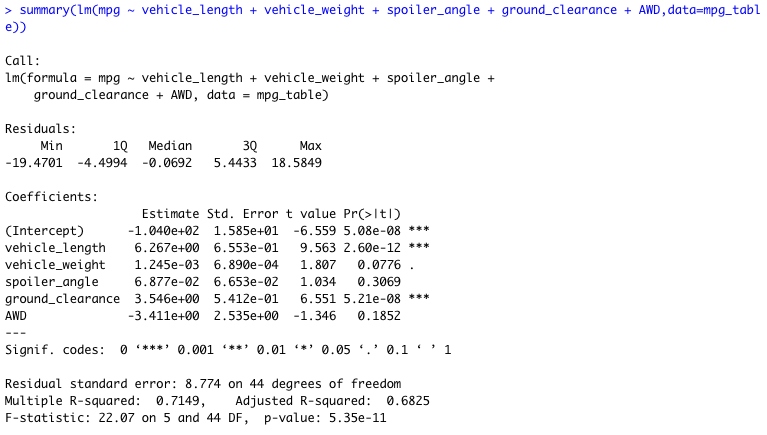

# MechaCar_Statistical_Analysis

## Overview

## Linear Regression to Predict MPG
 
 
   - According to our results, the vehicle length, ground clearance, and intercept provide a non-random amount of variance to the mpg values. 

   - The slope of this linear model is not considered to be zero because a significant linear relationship exists between dependent and independent variables and therefore the dependent value (mpg) is not determined by random chance. 

   - This model does not predict the mpg of MechaCar prototypes effectively because the intercept is statistically significant which means there are other variables that contribute to the variation in mpg values that have not been included in our model. 

## Summary Statistics on Suspension Coils

  
   - The current manufacturing data meets the design specification for all manufacturing lots as the total variance for all lots combined is 62.294, below the 100 pounds per square inch specification. However, when looking at the data per individual lot, we can see that Lot 3 has a variance of 170.286 pounds per square inch which exceeds the 100 pound maximum and therefore does not meet the design specification. 

## T-Tests on Suspension Coils

   - When looking at the t-test results for Lot 1, we can see that the p-value is equal to 1 because the mean PSI for Lot 1 is exactly 1500 pounds, the same as the population mean that we compared it to. Therefore, we can state that the two means are statistically similar. 
 
   - The t-test results for Lot 2 provide a p-value of .6072 which is above our significance level of .05. Therefore, we can state that the two means are statistically similar.
  
   - The t-test results for Lot 3 provide a p-value of .04168 which is below our signficance level of .05. Therefore, we have sufficient evidence to reject the null hypothesis and we can state that the two means are statistically different. 

## Study Design: MechaCar vs. Competition
Write a short description of a statistical study that can quantify how the MechaCar performs against the competition. In your study design, think critically about what metrics would be of interest to a consumer: for a few examples, cost, city or highway fuel efficiency, horse power, maintenance cost, or safety rating.
In your description, address the following questions:
What metric or metrics are you going to test?
What is the null hypothesis or alternative hypothesis?
What statistical test would you use to test the hypothesis? And why?
What data is needed to run the statistical test?
